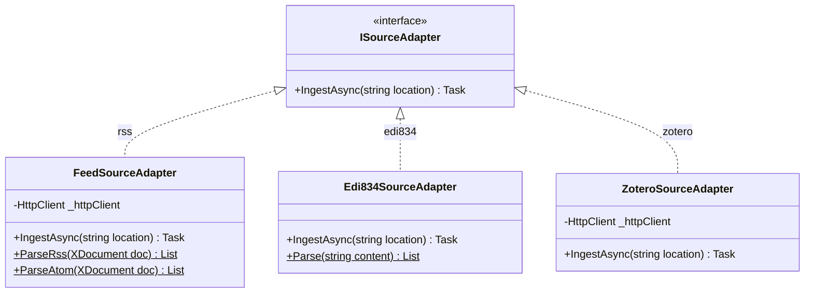

# Class Diagram: Source Adapters

The source adapter interface and its three implementations.

```mermaid
classDiagram
    class ISourceAdapter {
        <<interface>>
        +IngestAsync(string location) Task
    }

    class FeedSourceAdapter {
        -HttpClient _httpClient
        +IngestAsync(string location) Task
        +ParseRss(XDocument doc)$ List
        +ParseAtom(XDocument doc)$ List
    }

    class Edi834SourceAdapter {
        +IngestAsync(string location) Task
        +Parse(string content)$ List
    }

    class ZoteroSourceAdapter {
        -HttpClient _httpClient
        +IngestAsync(string location) Task
    }

    ISourceAdapter <|.. FeedSourceAdapter : rss
    ISourceAdapter <|.. Edi834SourceAdapter : edi834
    ISourceAdapter <|.. ZoteroSourceAdapter : zotero
```
