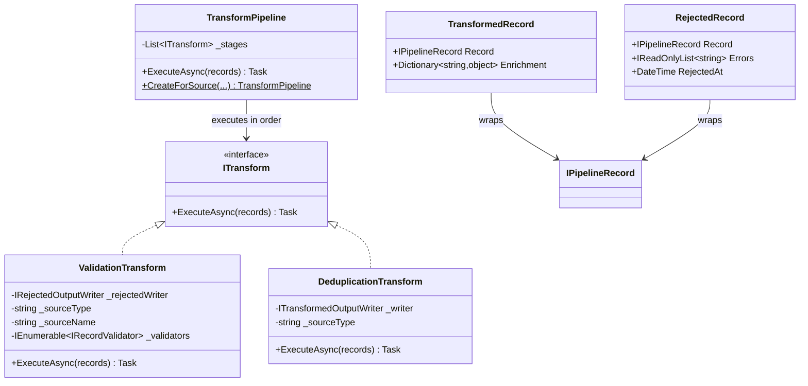

# Class Diagram: Pipeline Infrastructure

The transform pipeline, its stages, and the envelope types that carry records through it.

```mermaid
classDiagram
    class ITransform {
        <<interface>>
        +ExecuteAsync(records) Task
    }

    class TransformPipeline {
        -List~ITransform~ _stages
        +ExecuteAsync(records) Task
        +CreateForSource(...)$ TransformPipeline
    }

    class ValidationTransform {
        -IRejectedOutputWriter _rejectedWriter
        -string _sourceType
        -string _sourceName
        -IEnumerable~IRecordValidator~ _validators
        +ExecuteAsync(records) Task
    }

    class DeduplicationTransform {
        -ITransformedOutputWriter _writer
        -string _sourceType
        +ExecuteAsync(records) Task
    }

    class TransformedRecord {
        +IPipelineRecord Record
        +Dictionary~string,object~ Enrichment
    }

    class RejectedRecord {
        +IPipelineRecord Record
        +IReadOnlyList~string~ Errors
        +DateTime RejectedAt
    }

    ITransform <|.. ValidationTransform
    ITransform <|.. DeduplicationTransform
    TransformPipeline --> ITransform : executes in order
    TransformedRecord --> IPipelineRecord : wraps
    RejectedRecord --> IPipelineRecord : wraps
```
