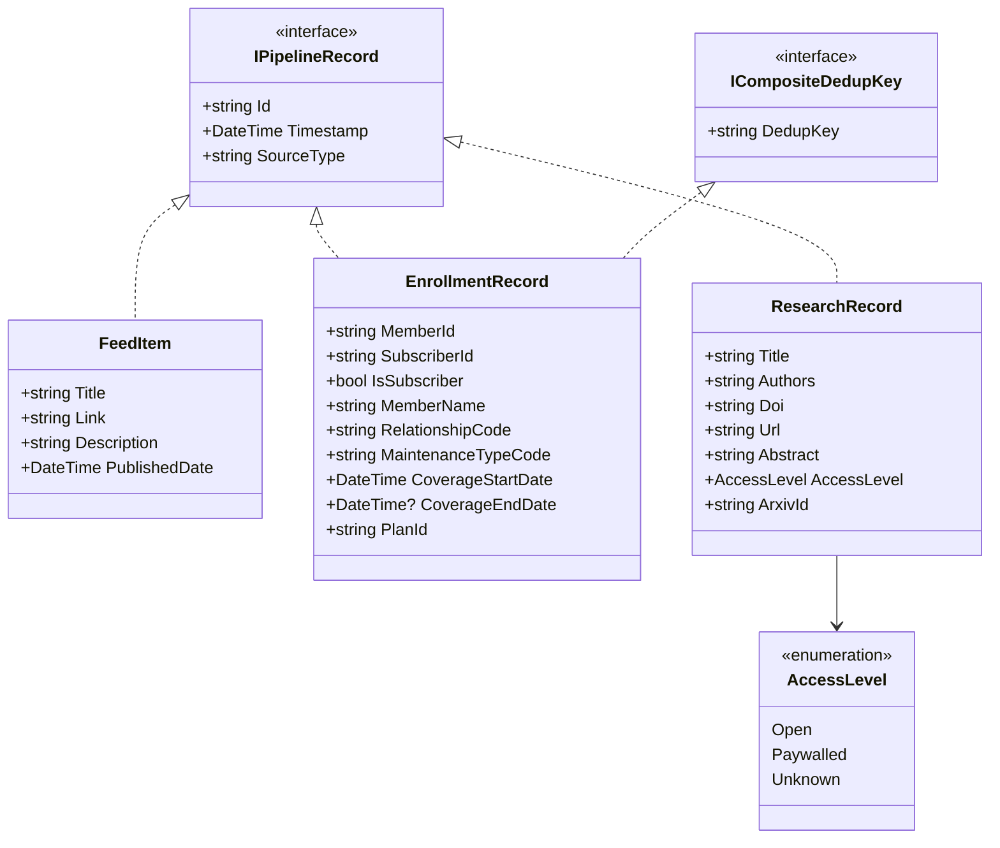

# Class Diagram: Domain Record Types

The three concrete record types and the interfaces they implement.

```mermaid
classDiagram
    class IPipelineRecord {
        <<interface>>
        +string Id
        +DateTime Timestamp
        +string SourceType
    }

    class ICompositeDedupKey {
        <<interface>>
        +string DedupKey
    }

    class FeedItem {
        +string Title
        +string Link
        +string Description
        +DateTime PublishedDate
    }

    class EnrollmentRecord {
        +string MemberId
        +string SubscriberId
        +bool IsSubscriber
        +string MemberName
        +string RelationshipCode
        +string MaintenanceTypeCode
        +DateTime CoverageStartDate
        +DateTime? CoverageEndDate
        +string PlanId
    }

    class ResearchRecord {
        +string Title
        +string Authors
        +string Doi
        +string Url
        +string Abstract
        +AccessLevel AccessLevel
        +string ArxivId
    }

    class AccessLevel {
        <<enumeration>>
        Open
        Paywalled
        Unknown
    }

    IPipelineRecord <|.. FeedItem
    IPipelineRecord <|.. EnrollmentRecord
    IPipelineRecord <|.. ResearchRecord
    ICompositeDedupKey <|.. EnrollmentRecord
    ResearchRecord --> AccessLevel
```
