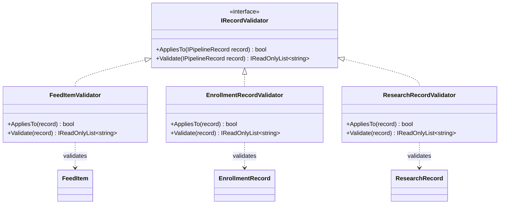

# Class Diagram: Record Validators

The validator interface and its source-specific implementations.

```mermaid
classDiagram
    class IRecordValidator {
        <<interface>>
        +AppliesTo(IPipelineRecord record) bool
        +Validate(IPipelineRecord record) IReadOnlyList~string~
    }

    class FeedItemValidator {
        +AppliesTo(record) bool
        +Validate(record) IReadOnlyList~string~
    }

    class EnrollmentRecordValidator {
        +AppliesTo(record) bool
        +Validate(record) IReadOnlyList~string~
    }

    class ResearchRecordValidator {
        +AppliesTo(record) bool
        +Validate(record) IReadOnlyList~string~
    }

    IRecordValidator <|.. FeedItemValidator
    IRecordValidator <|.. EnrollmentRecordValidator
    IRecordValidator <|.. ResearchRecordValidator

    FeedItemValidator ..> FeedItem : validates
    EnrollmentRecordValidator ..> EnrollmentRecord : validates
    ResearchRecordValidator ..> ResearchRecord : validates
```
