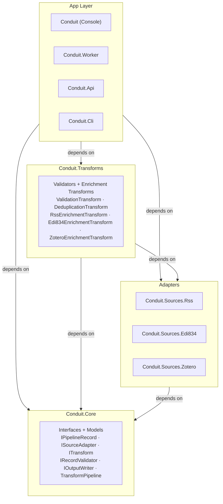

# Component Diagram: Layer Overview

The four layers and their dependency direction. All dependencies flow downward — no layer references anything above it.

See [interface-map.md](interface-map.md) for which classes implement which interfaces.
