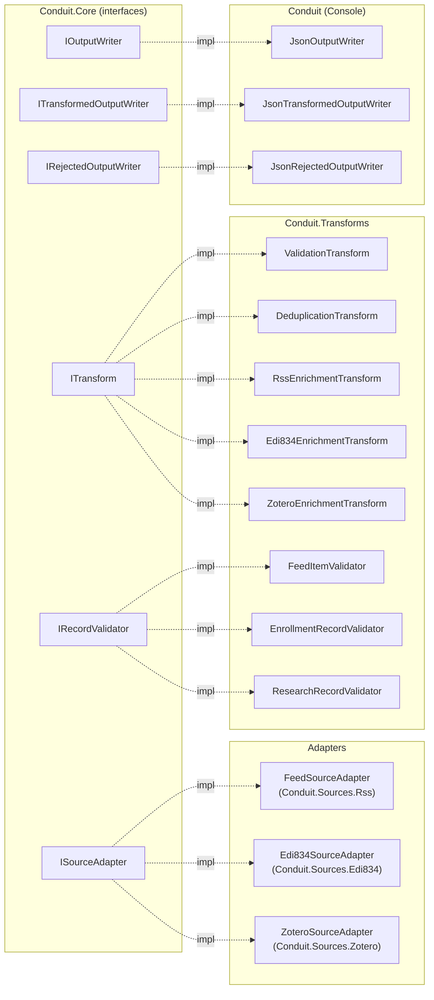

# Component Diagram: Interface Implementations

Which project each interface is defined in, and which class implements it.

```mermaid
graph LR
    subgraph Core["Conduit.Core (interfaces)"]
        ISourceAdapter["ISourceAdapter"]
        ITransform["ITransform"]
        IRecordValidator["IRecordValidator"]
        IOutputWriter["IOutputWriter"]
        ITransformedOutputWriter["ITransformedOutputWriter"]
        IRejectedOutputWriter["IRejectedOutputWriter"]
    end

    subgraph Adapters["Adapters"]
        FeedSourceAdapter["FeedSourceAdapter\n(Conduit.Sources.Rss)"]
        Edi834SourceAdapter["Edi834SourceAdapter\n(Conduit.Sources.Edi834)"]
        ZoteroSourceAdapter["ZoteroSourceAdapter\n(Conduit.Sources.Zotero)"]
    end

    subgraph Transforms["Conduit.Transforms"]
        ValidationTransform["ValidationTransform"]
        DeduplicationTransform["DeduplicationTransform"]
        RssEnrich["RssEnrichmentTransform"]
        Edi834Enrich["Edi834EnrichmentTransform"]
        ZoteroEnrich["ZoteroEnrichmentTransform"]
        FeedItemValidator["FeedItemValidator"]
        EnrollmentValidator["EnrollmentRecordValidator"]
        ResearchValidator["ResearchRecordValidator"]
    end

    subgraph App["Conduit (Console)"]
        JsonOutputWriter["JsonOutputWriter"]
        JsonTransformedOutputWriter["JsonTransformedOutputWriter"]
        JsonRejectedOutputWriter["JsonRejectedOutputWriter"]
    end

    ISourceAdapter -.->|impl| FeedSourceAdapter
    ISourceAdapter -.->|impl| Edi834SourceAdapter
    ISourceAdapter -.->|impl| ZoteroSourceAdapter

    ITransform -.->|impl| ValidationTransform
    ITransform -.->|impl| DeduplicationTransform
    ITransform -.->|impl| RssEnrich
    ITransform -.->|impl| Edi834Enrich
    ITransform -.->|impl| ZoteroEnrich

    IRecordValidator -.->|impl| FeedItemValidator
    IRecordValidator -.->|impl| EnrollmentValidator
    IRecordValidator -.->|impl| ResearchValidator

    IOutputWriter -.->|impl| JsonOutputWriter
    ITransformedOutputWriter -.->|impl| JsonTransformedOutputWriter
    IRejectedOutputWriter -.->|impl| JsonRejectedOutputWriter
```
