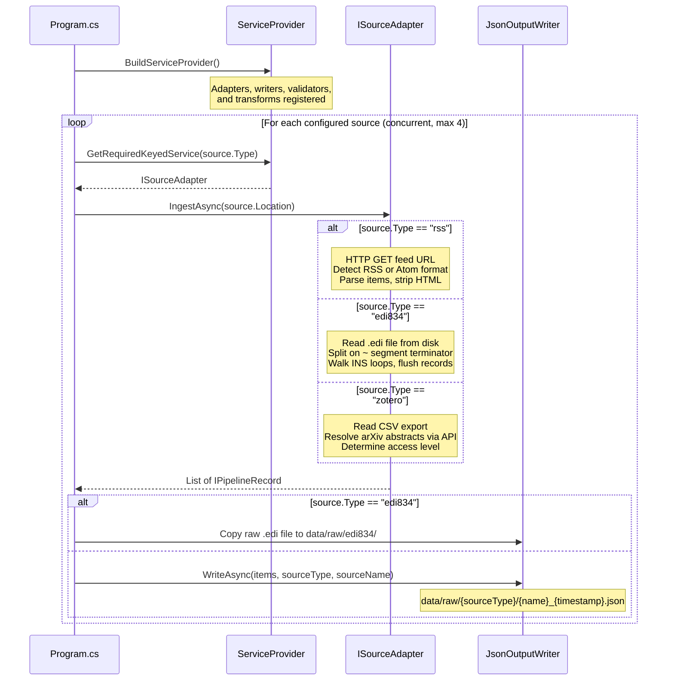

# Sequence Diagram: Ingestion Phase

How a single source is ingested and written to raw output.

```mermaid
sequenceDiagram
    participant P as Program.cs
    participant DI as ServiceProvider
    participant A as ISourceAdapter
    participant RW as JsonOutputWriter

    P->>DI: BuildServiceProvider()
    Note over DI: Adapters, writers, validators,<br/>and transforms registered

    loop For each configured source (concurrent, max 4)
        P->>DI: GetRequiredKeyedService(source.Type)
        DI-->>P: ISourceAdapter

        P->>A: IngestAsync(source.Location)

        alt source.Type == "rss"
            Note over A: HTTP GET feed URL<br/>Detect RSS or Atom format<br/>Parse items, strip HTML
        else source.Type == "edi834"
            Note over A: Read .edi file from disk<br/>Split on ~ segment terminator<br/>Walk INS loops, flush records
        else source.Type == "zotero"
            Note over A: Read CSV export<br/>Resolve arXiv abstracts via API<br/>Determine access level
        end

        A-->>P: List of IPipelineRecord

        alt source.Type == "edi834"
            P->>RW: Copy raw .edi file to data/raw/edi834/
        else
            P->>RW: WriteAsync(items, sourceType, sourceName)
            Note over RW: data/raw/{sourceType}/{name}_{timestamp}.json
        end
    end
```
