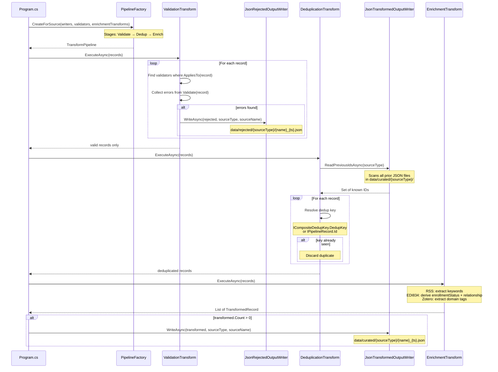

# Sequence Diagram: Transform Phase

How records flow through validation, deduplication, enrichment, and output after ingestion.

```mermaid
sequenceDiagram
    participant P as Program.cs
    participant PF as PipelineFactory
    participant VT as ValidationTransform
    participant RJW as JsonRejectedOutputWriter
    participant DT as DeduplicationTransform
    participant TW as JsonTransformedOutputWriter
    participant ET as EnrichmentTransform

    P->>PF: CreateForSource(writers, validators, enrichmentTransforms)
    Note over PF: Stages: Validate → Dedup → Enrich
    PF-->>P: TransformPipeline

    P->>VT: ExecuteAsync(records)
    loop For each record
        VT->>VT: Find validators where AppliesTo(record)
        VT->>VT: Collect errors from Validate(record)
        alt errors found
            VT->>RJW: WriteAsync(rejected, sourceType, sourceName)
            Note over RJW: data/rejected/{sourceType}/{name}_{ts}.json
        end
    end
    VT-->>P: valid records only

    P->>DT: ExecuteAsync(records)
    DT->>TW: ReadPreviousIdsAsync(sourceType)
    Note over TW: Scans all prior JSON files<br/>in data/curated/{sourceType}/
    TW-->>DT: Set of known IDs
    loop For each record
        DT->>DT: Resolve dedup key
        Note over DT: ICompositeDedupKey.DedupKey<br/>or IPipelineRecord.Id
        alt key already seen
            Note over DT: Discard duplicate
        end
    end
    DT-->>P: deduplicated records

    P->>ET: ExecuteAsync(records)
    Note over ET: RSS: extract keywords<br/>EDI834: derive enrollmentStatus + relationship<br/>Zotero: extract domain tags
    ET-->>P: List of TransformedRecord

    alt transformed.Count > 0
        P->>TW: WriteAsync(transformed, sourceType, sourceName)
        Note over TW: data/curated/{sourceType}/{name}_{ts}.json
    end
```
